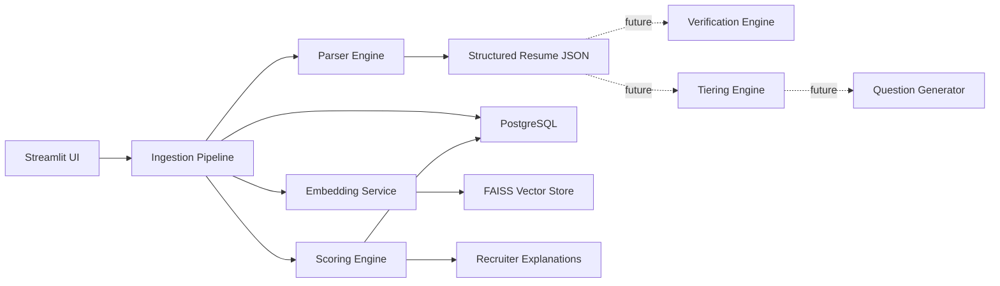
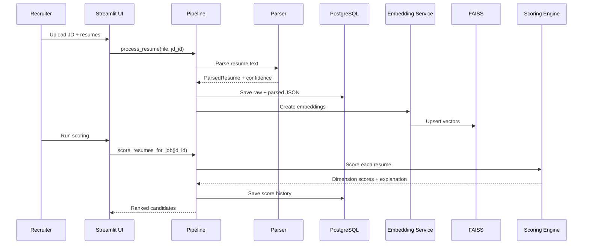

# Assignment 5 - System Design Document

## 1. Overview

This project is an AI Resume Shortlisting and Interview Assistant system designed for local-first execution.

Current implementation depth is focused on **Option A (Evaluation and Scoring Engine)**.

Future-ready design is included for:

- **Option B**: Claim Verification Engine (GitHub/LinkedIn authenticity and activity checks)
- **Option C**: Tiering and Interview Question Generator

The design is modular so these can be added without rewriting core ingestion and scoring.

## 2. Goals and Scope

### In Scope (Implemented)

- Parse resume files (`pdf`, `docx`, `doc`) into structured JSON.
- Parse job descriptions and auto-extract constraints (skills, degree hints, min years).
- Compute multi-dimensional score:
  - Exact Match
  - Semantic Similarity
  - Achievement
  - Ownership
- Provide recruiter-friendly explanation and strict rejection reasons.
- Persist data in PostgreSQL and store local vectors in FAISS.

### In Scope (Designed, Future Add-ons)

- Claim Verification Engine (Option B).
- Tier A/B/C classification and Interview Question Generator (Option C).

### Out of Scope (Current)

- Full distributed deployment code.
- Real-time external social API integrations in production mode.

## 3. High-Level Architecture

### Component Responsibilities

- **UI**: Upload resumes/JDs, trigger scoring, view ranked outputs.
- **Parser Engine**: Deterministic parse first, optional LLM fallback when confidence is low.
- **Scoring Engine**: Produces four scores plus final weighted score and explanation.
- **Embedding Service**: Encodes resume and JD text for semantic alignment.
- **Storage**: PostgreSQL for records and history, FAISS for fast local vector operations.
- **Future Verification Engine**: Adds confidence on social/public claims.
- **Future Tiering + Question Engine**: Converts scores/profile into interview paths.

## 4. End-to-End Data Flow

## 5. Data Strategy

### 5.1 Unstructured to Structured

1. Extract text from resume/JD files.
2. Run deterministic parser using section heuristics.
3. Compute parser confidence.
4. If confidence is low and LLM mode is enabled, run strict JSON fallback.
5. Validate with Pydantic schemas.
6. Store:
   - raw extracted text
   - parsed structured JSON
   - diagnostics (mode, confidence, reasons, timing)

### 5.2 Core Structured Schema

- Candidate details and contact links
- Skills, experience, education, projects, certifications
- Parser diagnostics and score diagnostics

This enables reproducibility and explainability because each final score can be traced back to structured inputs.

## 6. AI Strategy

### 6.1 Embeddings

- Model: `sentence-transformers/all-MiniLM-L6-v2`
- Reason:
  - Local and free
  - Fast enough for recruiter workflows
  - Good trade-off between quality and latency

### 6.2 LLM Strategy

- Default mode: local-first (no paid dependency required)
- Provider-flexible design: local Ollama now, easy adapter path for OpenAI/Anthropic later
- LLM usage currently focused on parser fallback, not mandatory for core path

### 6.3 Semantic Similarity Methodology

Approach: **embedding similarity + alias/concept mapping layer**.

- Embedding similarity handles broad contextual match.
- Alias map handles practical role-language equivalents.

Example mapping groups for role-fit scoring:

- Streaming systems: Kafka, AWS Kinesis, RabbitMQ, Pulsar
- Containers: Docker, containerization
- Cloud providers: AWS, Azure, GCP

This hybrid improves matching where direct keyword overlap is weak.

## 7. Scoring and Explainability

### 7.1 Multi-Dimensional Scores

- **Exact Match**: required skill match and JD term overlap.
- **Semantic Similarity**: embedding-based alignment between resume profile text and JD text.
- **Achievement**: quantified impact and achievement language signals.
- **Ownership**: leadership and ownership language by role context.

### 7.2 Strict Rejections

- Minimum years of experience
- Required degree constraints

If strict constraints fail, candidate is auto-flagged and explanation includes reasons.

### 7.3 Explainability Output

For each candidate output:

1. Final score
2. Dimension-wise score and note
3. Short recruiter explanation
4. Rejection trace (if any)

## 8. Option B (Future) - Claim Verification Engine

### 8.1 Objective

Check authenticity and activity signals from submitted public links.

### 8.2 Planned Checks (Medium Depth)

- URL validity and profile reachability
- Basic profile consistency (name/username similarity)
- Public activity freshness (recent commits/posts)
- Repo signal quality (stars/forks/commit continuity)
- Suspicious patterns (new account, no activity, mismatch)

### 8.3 Output

- Verification score (0-100)
- Risk flags list
- Human-readable summary for recruiters

## 9. Option C (Future) - Tiering + Question Generator

### 9.1 Tiering

Tier policy:

- Tier A: fast-track interview
- Tier B: technical screen
- Tier C: manual review or additional assessment

Input features:

- Total score
- Dimension distribution
- Rejection status
- Optional verification score (from Option B)

### 9.2 Hybrid Question Generation

Method: **rule-seeded + LLM refinement**.

1. Seed question topics from skills, projects, and weak dimensions.
2. Apply difficulty ladder (easy -> medium -> deep-dive).
3. Use LLM to generate role-specific questions in strict JSON schema.
4. Fallback to templates if LLM unavailable.

Output per candidate:

- 6-10 technical questions
- expected-signal rubric
- follow-up question tree

## 10. Scalability Plan (10,000+ resumes/day)

Design target is a multi-worker pipeline while preserving local-first dev simplicity.

### 10.1 Processing Model

- API/UI layer is stateless.
- Background queue for ingestion and scoring tasks.
- Worker pools split by stage:
  - parsing workers
  - embedding workers
  - scoring workers

### 10.2 Throughput Strategy

- Batch embedding calls.
- Reuse cached vectors for repeated JD scoring sessions.
- Idempotent job keys to avoid duplicate processing.
- Retry queue with capped attempts and dead-letter handling.

### 10.3 Data and Index Strategy

- PostgreSQL partitioning/indexing for high-volume score history.
- FAISS maintained as local vector index for current architecture.
- Periodic compaction/reindex jobs during low-traffic windows.

### 10.4 Reliability and Observability

- Per-stage latency metrics (parse, vector, score, db write).
- Success/failure counters and retry reasons.
- Health checks for DB, model load, and queue lag.

### 10.5 Capacity View (Illustrative)

- 10,000 resumes/day is about 417 resumes/hour at steady load.
- With horizontal workers and batching, this is feasible on modest infra.
- Burst handling comes from queue buffering and worker autoscaling.

### 10.6 Measured Benchmark Evidence (Current Build)

The following measurements were captured from local benchmark runs using synthetic data.

Test setup:

- JD sample size: 5000 resumes attached to one job description
- Benchmark command shape: `--warmups 0 --runs 3 --max-resumes 300`
- Embedding model: `sentence-transformers/all-MiniLM-L6-v2`

Run A (compute-only, no score persistence):

- `persist_scores=false`
- `avg_run_seconds=2.35`
- `throughput_rows_per_second=127.68`
- `projected_rows_per_day=11,031,865`
- `meets_target=true`

Run B (includes DB score writes):

- `persist_scores=true`
- `avg_run_seconds=2.042`
- `throughput_rows_per_second=146.9`
- `projected_rows_per_day=12,692,106`
- `meets_target=true`
- sample timing shows DB write cost captured (`db_write_total=25.65ms` in sampled run)

Interpretation:

- The implemented Option A scoring pipeline exceeds the 10,000 resumes/day target on tested hardware.
- First run is slower due to model warm-up; subsequent warm runs are significantly faster.
- For production planning, use p95 and p99 metrics and include larger repeated runs during capacity validation.

## 11. Security and Privacy

- Local-first default to reduce data egress.
- Environment-based configuration for secrets.
- Store only required candidate data and audit score changes.
- Avoid logging sensitive personal text in debug logs.

## 12. Trade-offs and Risks

- Local models are cheaper but can be less accurate than large hosted models.
- Heuristic parsing is fast but may miss unusual resume layouts.
- FAISS local index is simple, but needs disciplined maintenance for scale.

Mitigation:

- Confidence-gated fallback parser
- explicit scoring explanations
- modular architecture for future provider and storage upgrades

## 13. Implementation Status Snapshot

- Implemented deeply: Option A (Scoring Engine and scoring flow)
- Designed for next phase: Option B and Option C

This matches the assignment instruction to prioritize depth over breadth while still documenting complete architecture.