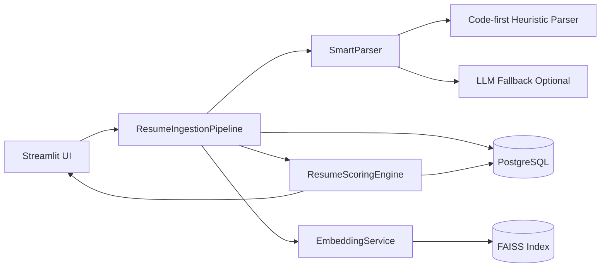
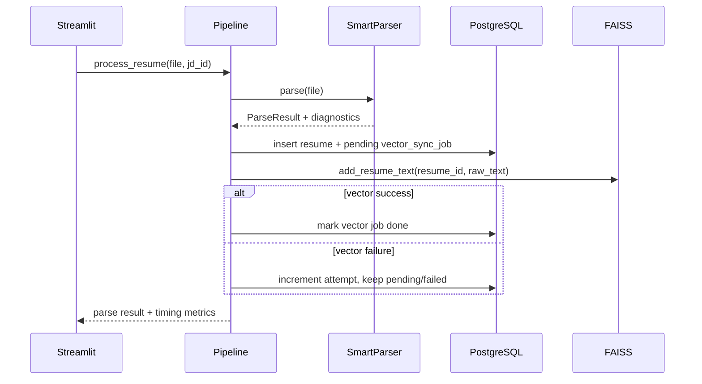
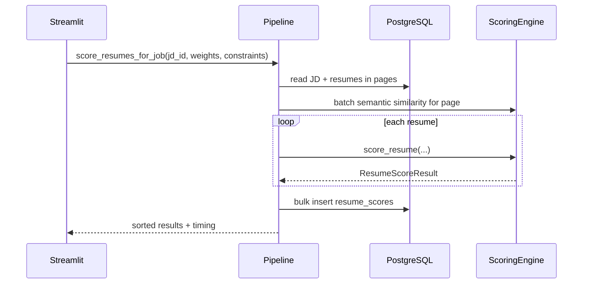

# System Design

## 1. Problem Statement

Build a practical, local-first resume intelligence system that:

- ingests resumes and job descriptions,
- parses resumes into structured data,
- scores candidates against a selected JD,
- provides explainable recruiter-facing output,
- runs with minimal infrastructure complexity.

Current implementation depth is Option A (evaluation and scoring engine).

## 2. Design Goals

- Local-first operation with PostgreSQL + FAISS.
- Deterministic default parsing path (no paid API dependency required).
- Optional LLM fallback for low-confidence parse cases.
- Explainable scoring, including strict-rule rejection reasons.
- Scoring pipeline that can process large JD-linked resume sets efficiently.

## 3. Architecture Overview

## 4. Core Components

### 4.1 Streamlit UI

Responsibilities:

- collect JD input and optional JD files,
- upload resumes,
- trigger parse and scoring,
- display parsed payload, diagnostics, and ranked scoring output.

UI enforces resume upload guardrails:

- ideal size: < 1 MB,
- hard limit: 2 MB.

### 4.2 Orchestration Pipeline

`ResumeIngestionPipeline` coordinates:

1. parse resume,
2. save parsed output,
3. queue vector sync,
4. attempt immediate FAISS upsert,
5. retry pending vector jobs,
6. batch score resumes page-by-page,
7. bulk-persist score rows.

### 4.3 Smart Parser

`SmartParser` strategy:

- extract text from file,
- parse with deterministic code-first heuristics,
- compute confidence and sparse-signal checks,
- if needed, run LLM fallback,
- merge fallback output when beneficial.

Fallback mode is configurable via env vars:

- `LLM_MODE=none|openai|anthropic`
- `FORCE_LLM_ONLY=true|false`

### 4.4 Scoring Engine

`ResumeScoringEngine` computes four dimensions:

- Exact Match
- Semantic Similarity
- Achievement
- Ownership

It then:

- normalizes weights,
- applies strict rejection checks,
- caps rejected totals at 40,
- emits dimension notes and recruiter explanation payload.

### 4.5 Embedding and Vector Layer

`EmbeddingService`:

- loads sentence-transformers model once per model name,
- supports per-text and batch encode,
- includes LRU-style in-memory embedding cache.

`FaissVectorStore`:

- stores vectors keyed by resume id,
- supports incremental upsert (`remove_ids` + `add_with_ids`),
- persists index to disk and metadata to JSON,
- supports search and delete.

### 4.6 Persistence Layer

`PostgresStore` provides table creation and CRUD helpers for:

- job descriptions,
- parsed resumes,
- score history,
- vector sync queue state.

## 5. Data Model

Main tables:

- `job_descriptions`
- `resumes`
- `resume_scores`
- `vector_sync_jobs`

Design highlights:

- Parsed resume payload stored as JSON (`parsed_json`).
- Scoring dimension breakdown stored as JSON (`dimension_scores`).
- `recruiter_explanation` stored as text JSON string for direct UI display.
- Vector sync reliability handled via queue table with status and retry counts.

## 6. End-to-End Flows

### 6.1 Parse + Persist + Vector Sync

### 6.2 Scoring Flow

## 7. Scoring and Explainability Details

### 7.1 Dimension Computation

- Exact Match:
  - required skill matching when constraints include skills,
  - otherwise overlap with JD term set.
- Semantic Similarity:
  - cosine-equivalent dot product on normalized embeddings,
  - mapped to 0-100 scale via `(score + 1) * 50`.
- Achievement:
  - quantified metrics + achievement action terms from raw text.
- Ownership:
  - strong vs support verb signals by role,
  - role-title weighting,
  - recent-role emphasis (60/40 split).

### 7.2 Strict Rejection Rules

- Minimum years requirement enforced only when experience evidence is inferrable.
- Degree keyword constraints with alias matching.

If any strict rule fails:

- `rejected = true`,
- rejection reasons are recorded,
- final score is capped at 40.

### 7.3 Recruiter Explanation Payload

Each score includes a compact JSON explanation containing:

- candidate,
- decision (`REVIEW` or `REJECT`),
- skills_match note,
- semantic_fit note,
- experience signal,
- risk flags,
- recommendation.

## 8. Reliability and Performance Design

Implemented reliability mechanisms:

- vector sync queue with retry attempts (`MAX_VECTOR_SYNC_ATTEMPTS=5`),
- startup retry of pending vector jobs,
- graceful parse continue when fallback fails,
- timing metrics attached to parse and scoring outputs.

Implemented performance mechanisms:

- reusable embedding model instance,
- embedding cache for repeated text encoding,
- batch semantic scoring per page,
- paginated resume fetch during scoring,
- bulk DB writes for score rows,
- incremental FAISS upserts by resume id.

## 9. Configuration Model

Configuration is environment-driven (`src/config.py`):

- storage and embedding settings,
- parser mode settings,
- LLM provider credentials and endpoints.

`.env.example` documents practical mode presets:

- deterministic local mode,
- OpenAI fallback mode,
- Anthropic fallback mode,
- forced LLM-only modes.

## 10. Validation and Benchmarking

Included scripts provide repeatable quality/performance checks:

- `scripts/run_parser_qa.py`: parser QA on mildly unstructured samples.
- `scripts/run_small_scoring_eval.py`: top-1/top-k/rejection correctness checks.
- `scripts/run_small_scoring_stability.py`: randomized stability under weight/text perturbation.
- `scripts/benchmark_option_a.py`: throughput and latency benchmarking.
- `scripts/seed_benchmark_resumes.py`: synthetic large-set data seeding.

## 11. Known Constraints

- `.doc` parsing depends on optional `textract` and system binaries.
- Current deployment target is local/single-node workflow.
- LLM fallback requires external credentials and network availability.
- Vector index is local FAISS file-backed storage.

## 12. Extensibility Roadmap

The current modular structure allows clean extension for:

- Option B: claim verification service using public profile links.
- Option C: tier assignment and interview-question generation layer.

These can be added as additional pipeline stages without changing core parsing and scoring contracts.